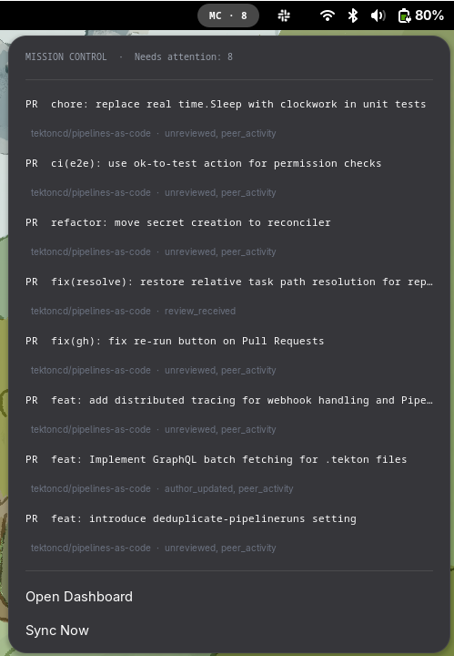

# GNOME Shell extension

The Mission Control extension adds a panel indicator to the GNOME top bar. It shows the number of items that need your attention, lets you open each one directly, and gives you a quick way to sync or open the dashboard — all without leaving whatever you're working on.

It requires the Mission Control server to be running. The extension just talks to it over HTTP.

**Supported GNOME Shell versions:** 45, 46, 47, 48, 49

---

## Prerequisites

- GNOME Shell 45 or later
- The `mission-control` server running (see [the dashboard docs](dashboard.md) for how to start it)
- `glib-compile-schemas` installed — it's part of the `glib2` / `libglib2.0-bin` package depending on your distro

---

## Enabling GNOME extensions

On a fresh GNOME install, third-party extensions are often blocked or the tooling isn't present. Check this before installing.

**1. Install the GNOME Extensions app**

This gives you a UI to manage and toggle extensions. It's also the easiest way to confirm extensions are working at all.

```sh
# Fedora / RHEL
sudo dnf install gnome-extensions-app

# Debian / Ubuntu
sudo apt install gnome-shell-extension-manager
```

Alternatively, the [Extensions](https://apps.gnome.org/Extensions/) app is available on Flathub:

```sh
flatpak install flathub org.gnome.Extensions
```

**2. Make sure user extensions are not disabled**

Some distros ship with user extensions turned off globally. Check:

```sh
gsettings get org.gnome.shell disable-user-extensions
```

If this returns `true`, enable them:

```sh
gsettings set org.gnome.shell disable-user-extensions false
```

**3. Allow unsigned extensions (if required)**

GNOME 45+ introduced a setting that can block extensions not distributed through extensions.gnome.org. If `gnome-extensions enable` returns an error about the extension not being allowed, run:

```sh
gsettings set org.gnome.shell allow-extension-installation true
```

You only need to do this once.

---

## First install

```sh
make install-gnome-ext
```

This copies the extension files into `~/.local/share/gnome-shell/extensions/` and compiles the settings schema.

After that you need to **log out and back in** (required on Wayland — the shell needs to restart to pick up the new extension). Then enable it:

```sh
gnome-extensions enable mission-control@theakshaypant
```

You should see the **MC** indicator appear in the top bar.

---

## Updating

If the extension is already enabled, you don't need to log out. Just run:

```sh
make update-gnome-ext
```

This copies the updated files, recompiles the schema, and restarts the extension in place.

---

## Configuration

By default the extension connects to `http://localhost:5040`. If your server runs on a different address or port, update the setting:

```sh
gsettings set org.gnome.shell.extensions.mission-control api-url 'http://localhost:8080'
```

The extension picks up the new value the next time it refreshes (every 30 seconds), or immediately when you open the menu.

---

## Using the indicator



When items need your attention the label shows **MC · N** where N is the count. When everything is clear it shows just **MC**. If the server can't be reached it shows **MC ⚠**.

Click the indicator to open the menu:

- Each item that needs attention is listed with its type, title, namespace, and the signals that fired. Clicking an item opens it in your browser.
- **Open Dashboard** opens the full web UI.
- **Sync Now** triggers an immediate sync across all sources and refreshes the menu.

The menu also refreshes automatically whenever you open it, and in the background every 30 seconds.

---

## Uninstalling

Disable the extension first:

```sh
gnome-extensions disable mission-control@theakshaypant
```

Then remove the files:

```sh
rm -rf ~/.local/share/gnome-shell/extensions/mission-control@theakshaypant
```

---

## Troubleshooting

**The indicator doesn't appear after enabling.**
Log out and back in if you haven't already. On Wayland, new extensions aren't loaded until the session restarts.

**MC ⚠ is shown in the panel.**
The extension can't reach the server. Make sure `mission-control` is running and the `api-url` setting points to the right address. Check with:

```sh
gsettings get org.gnome.shell.extensions.mission-control api-url
```

**The extension isn't listed by `gnome-extensions list`.**
The install step may not have run, or the UUID doesn't match. Verify the directory exists:

```sh
ls ~/.local/share/gnome-shell/extensions/mission-control@theakshaypant
```

If it's missing, run `make install-gnome-ext` again and log out/in.

**Schema errors on install.**
Make sure `glib-compile-schemas` is installed. On Fedora/RHEL: `sudo dnf install glib2-devel`. On Debian/Ubuntu: `sudo apt install libglib2.0-bin`.
